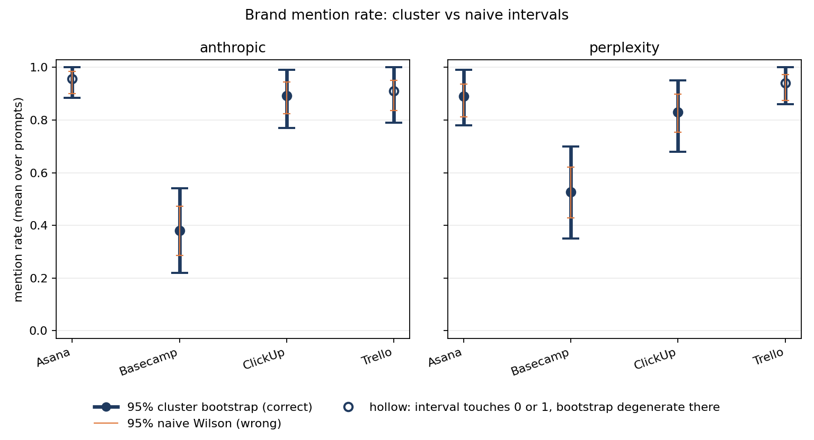

# geo-probe

Measures how much an LLM's brand recommendations vary, and computes how large a
week-over-week change has to be before it can be distinguished from that
variation.

## The question

Ask a language model which project management tool a small team should use, and
it will not give the same answer twice. Any "brand visibility" percentage built
on those answers is a measurement with noise in it, not a fact that was looked
up. This tool measures the noise properly and reports the resulting detection
threshold: the smallest change the design can actually see.

## Result

- **Design effect 2.89** (range 1.90–3.49). Treating each run as an independent
  trial understates the variance by that factor; the honest interval is √2.89 ≈
  **1.7× wider** than the conventional one.
- **MDE 21.3pp to 35.4pp** at α=0.05, power=0.80, across the cells whose
  intervals clear both bounds. Demanding a threshold that reads in both
  directions raises the floor to 32.6pp — [full ladder](docs/RESULTS.md).
- At 20 prompts × 5 repetitions, a brand's mention rate has to move by roughly a
  fifth to a third before the change is distinguishable from sampling noise.

Full results and interpretation → [docs/RESULTS.md](docs/RESULTS.md)



## How it works

**Probe** sends 20 buyer-intent prompts to each provider 5 times each, at normal
temperature and with no seed. The prompts never name a brand, and the variation
between repetitions is the signal, not something to be suppressed.

**Extract** is a second, separate pass at temperature 0 that reads only the
response text and the brand list, and decides which brands were mentioned. It is
kept apart from the probe so that grading is reproducible even though the thing
being graded is not, and so a grading bug costs a cheap re-run instead of the
probe budget.

**Aggregate** treats the prompt, not the run, as the unit of analysis, and gets
its interval by resampling prompts. Repetitions of one prompt are correlated, so
pooling all runs as independent trials reports a precision the data does not
support. Why that matters → [docs/DESIGN.md](docs/DESIGN.md)

## Install

Requires Python 3.12+.

```bash
python -m venv .venv && source .venv/bin/activate   # Windows: .venv\Scripts\activate
pip install -e ".[dev]"
```

Supply both API keys, either by copying `.env.example` to `.env` and filling it
in:

```bash
cp .env.example .env
```

or by exporting them in the shell you run from — `$env:ANTHROPIC_API_KEY =
"sk-ant-..."` in PowerShell, `export ANTHROPIC_API_KEY=sk-ant-...` in bash.

The CLI reads `.env` from the directory you run it in and echoes which keys it
picked up. An exported variable wins over the file, so a stale `.env` cannot
silently override a key you just set. Loading `.env` is a convenience of the
command line only: importing `geo_probe` as a library reads the process
environment and nothing else.

Verify the install with no keys and no network:

```bash
pytest
```

## Run a batch

```bash
geo-probe probe --config config/experiment.yaml --prompts config/prompts.yaml
geo-probe extract           --batch <batch_id>
geo-probe diagnose-failures --batch <batch_id>
geo-probe sample-gold       --batch <batch_id> -n 30
geo-probe score-gold        --batch <batch_id>
geo-probe aggregate         --batch <batch_id>
geo-probe report            --batch <batch_id>
```

- `probe` prints a cost estimate (~$1.82) and the `batch_id`, then makes 200
  sequential API calls over 15–25 minutes. Re-run with `--batch <id>` to resume.
- `extract` grades every run: ~$0.43, a few minutes. Everything after it is
  offline and free.
- `diagnose-failures` compares runs whose grading failed against those that
  passed. Run it whenever exclusions are non-trivial, before touching the
  extractor.
- `sample-gold` writes a CSV to label by hand; `score-gold` then reports agreement,
  Cohen's kappa, and a bound on the extractor's error rate. Add `--from-recovered`
  for a second sample drawn from spans that matched only after normalisation.
- `aggregate` and `report` write `data/agg/<id>.{json,csv}` and
  `reports/<id>/{chart.png,findings.md}`.

Since `data/` is committed, the last two reproduce the published numbers from the
raw runs without any API key.

## Repo map

```
config/          experiment and prompt definitions
src/geo_probe/
  stats.py       wilson, cluster bootstrap, variance decomposition, MDE
  probe.py       stage 1 — sampling
  extract.py     stage 2 — grading, plus gold-set sampling and scoring
  aggregate.py   stage 3 — one record per (brand, provider), never pooled
  report.py      stage 4 — chart and findings
  diagnose.py    extraction-failure analysis
  providers/     one ABC, two implementations
tests/           139 tests, no network required
data/            raw runs, extracts, aggregates — committed so results re-run
reports/         generated chart, findings, and failure diagnoses
docs/            design note and results
```

## More

[docs/DESIGN.md](docs/DESIGN.md) — the argument, the decisions and what each cost,
and scope. [docs/RESULTS.md](docs/RESULTS.md) — findings, the extraction
correction, limitations.
[reports/2026-07-28T10-43-37Z/findings.md](reports/2026-07-28T10-43-37Z/findings.md)
— generated per-cell numbers, the source of truth for every figure quoted above.

MIT licensed — see [LICENSE](LICENSE).
